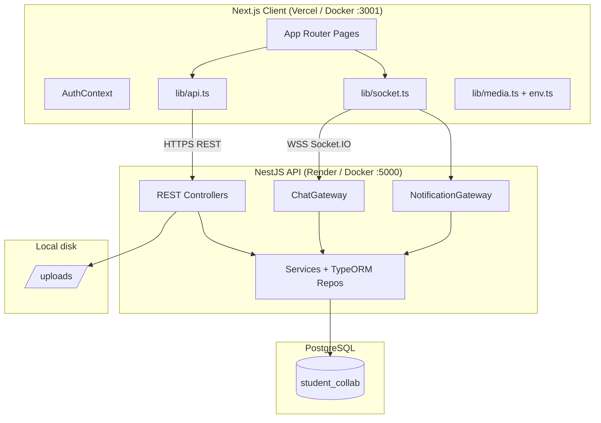
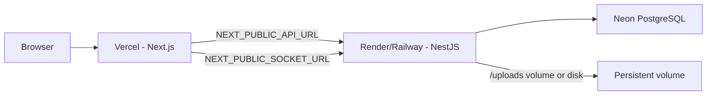
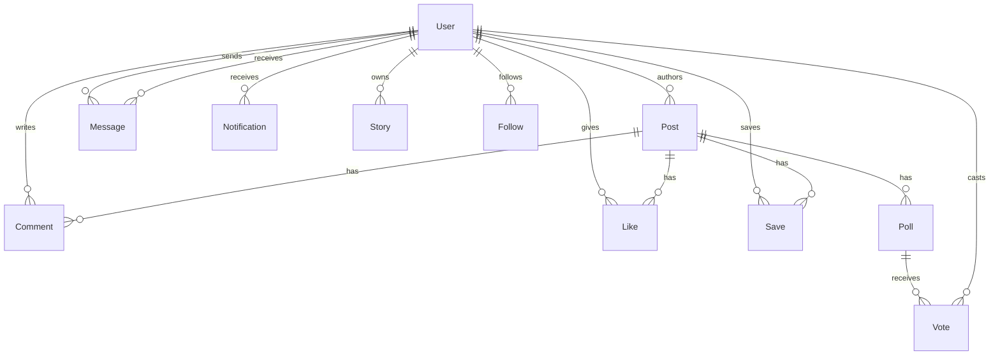
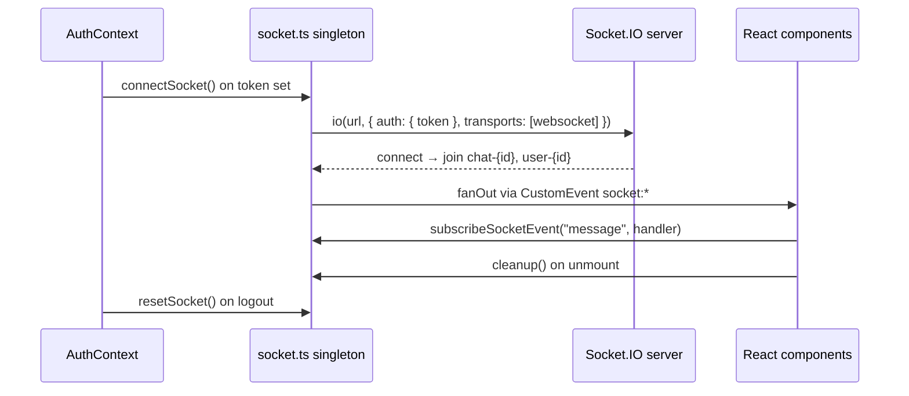
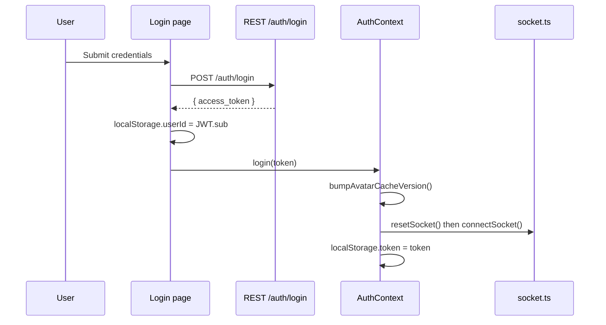

# ClassCircle — Final Master Engineering Report

| Field | Value |
|-------|-------|
| **Document** | `docs/FINAL_MASTER_REPORT.md` |
| **Product** | ClassCircle |
| **Version** | v3.0-production-candidate |
| **Status** | Production Candidate / Deployable SaaS MVP |
| **Last updated** | May 2026 |
| **Audience** | Engineers, DevOps, AI agents, technical stakeholders |

---

## Table of Contents

1. [Executive Summary](#1-executive-summary)
2. [Product Overview](#2-product-overview)
3. [Repository Layout](#3-repository-layout)
4. [Technology Stack](#4-technology-stack)
5. [System Architecture](#5-system-architecture)
6. [Deployment Architecture](#6-deployment-architecture)
7. [Environment Configuration](#7-environment-configuration)
8. [Frontend Architecture](#8-frontend-architecture)
9. [Backend Architecture](#9-backend-architecture)
10. [Database Schema](#10-database-schema)
11. [REST API Reference](#11-rest-api-reference)
12. [Realtime Architecture](#12-realtime-architecture)
13. [Authentication Lifecycle](#13-authentication-lifecycle)
14. [Socket Lifecycle (Client)](#14-socket-lifecycle-client)
15. [Premium UI / Design System](#15-premium-ui--design-system)
16. [Admin Dashboard & RBAC](#16-admin-dashboard--rbac)
17. [Production Hardening](#17-production-hardening)
18. [Docker & Compose](#18-docker--compose)
19. [Deployment Workflow](#19-deployment-workflow)
20. [Free-Tier Deployment Strategy](#20-free-tier-deployment-strategy)
21. [Critical Logic — Must Never Break](#21-critical-logic--must-never-break)
22. [Stabilization Notes](#22-stabilization-notes)
23. [Known Limitations](#23-known-limitations)
24. [Production Risks](#24-production-risks)
25. [QA & Testing Workflow](#25-qa--testing-workflow)
26. [Future Scalability Roadmap](#26-future-scalability-roadmap)
27. [AI Agent Onboarding Quick Reference](#27-ai-agent-onboarding-quick-reference)

---

## 1. Executive Summary

**ClassCircle** is a full-stack educational collaboration SaaS platform targeting coaching centers, schools, universities, and online learning communities. It replaces fragmented tools (WhatsApp, Facebook groups, Telegram, Discord) with a centralized, moderated, analytics-driven product.

The codebase is a **production candidate**: feature-complete MVP with premium UI, realtime messaging, notifications, RBAC admin tooling, Docker packaging, and production hardening applied to CORS, JWT, TypeORM sync, env centralization, socket lifecycle, and client resilience.

| Dimension | Assessment |
|-----------|------------|
| Portfolio / demo quality | Excellent |
| Commercial demo readiness | Excellent |
| Coaching-center SaaS MVP | Strong |
| Production deployment readiness | **Near production-ready** (env + hosting setup required) |
| Architecture quality | Modular, scalable foundation |
| Automated CI/CD & tests | Not yet implemented |

**Build verification (local):**

- Client: `cd client && npm run build` — Next.js 16 production build passes
- Server: `cd server && npm run build` — NestJS 11 compile passes

---

## 2. Product Overview

### 2.1 Branding

- **Official name:** ClassCircle
- **Type:** Premium educational collaboration SaaS

### 2.2 Core capabilities (shipped)

| Domain | Features |
|--------|----------|
| Social feed | Posts, images, files, polls, likes, saves, hide, report, infinite scroll (`take` + `skip`) |
| Discovery | Explore feed, trending hashtags |
| Profiles | Public/private profiles, edit profile, skills, links, profile views |
| Stories | Upload + viewer on dashboard |
| Messaging | 1:1 chat, files, reactions, edit/delete, typing, online users, FloatingMessenger + `/messages` |
| Notifications | Realtime + REST, mark read / mark all |
| Analytics | User engagement metrics and charts |
| Admin | Stats, moderation queue, user management, role/block/mute controls |
| Auth | JWT login, register, forgot-password endpoint |
| UX | Dark/light mode, glassmorphism design system, mobile-responsive layouts, skeleton loaders |

### 2.3 Explicitly out of scope (current release)

- Multi-tenant SaaS (organizations / tenants)
- Full teacher portal
- CI/CD pipelines
- Comprehensive automated test suite
- Object storage for uploads (disk-based Multer only)

---

## 3. Repository Layout

```
Student_Colab_platform/
├── client/                    # Next.js 16 frontend
│   ├── app/                   # App Router pages & route components
│   ├── components/            # Shared components (ui/, AvatarImage)
│   ├── context/               # AuthContext
│   ├── lib/                   # api, socket, env, media, adminApi, utils
│   ├── public/                # Static assets
│   ├── Dockerfile
│   ├── .env.example
│   └── next.config.ts
├── server/                    # NestJS 11 backend
│   ├── src/
│   │   ├── auth/              # JWT, roles, guards
│   │   ├── chat/              # Messages REST + ChatGateway
│   │   ├── notification/      # Notifications REST + NotificationGateway
│   │   ├── modules/
│   │   │   ├── user/          # Users, stories, follow
│   │   │   ├── post/          # Posts, polls, likes, saves
│   │   │   ├── comment/
│   │   │   └── admin/
│   │   ├── config/            # typeorm, multer, jwt
│   │   ├── common/            # HTTP exception filter
│   │   └── main.ts
│   ├── uploads/               # Runtime file storage (gitignored content)
│   ├── test/                  # e2e scaffold
│   ├── Dockerfile
│   └── .env.example
├── docs/
│   ├── FINAL_MASTER_REPORT.md # This document
│   ├── PROJECT_REPORT.md      # Prior engineering report
│   ├── DEPLOYMENT.md          # Deployment quick reference
│   └── AI_RULES.md            # Non-negotiable AI patch rules
├── docker-compose.yml
└── .gitignore
```

### 3.1 Frontend route map (`client/app/`)

| Route | File | Notes |
|-------|------|-------|
| `/` | `page.tsx` | Landing / redirect |
| `/login` | `login/page.tsx` | JWT login |
| `/register` | `register/page.tsx` | User registration |
| `/forgot` | `forgot/page.tsx` | Password reset UI |
| `/dashboard` | `dashboard/page.tsx` | Main feed, stories, suggested users |
| `/messages` | `messages/page.tsx` | Full-page messenger (FloatingMessenger hidden) |
| `/explore` | `explore/page.tsx` | Discovery feed |
| `/saved` | `saved/page.tsx` | Saved posts |
| `/analytics` | `analytics/page.tsx` | User analytics |
| `/profile` | `profile/page.tsx` | Own profile |
| `/profile/[id]` | `profile/[id]/page.tsx` | Public profile |
| `/admin` | `admin/page.tsx` | Admin overview |
| `/admin/users` | `admin/users/page.tsx` | User management (admin only) |
| `/admin/moderation` | `admin/moderation/page.tsx` | Moderation queue |
| `/admin/analytics` | `admin/analytics/page.tsx` | Platform analytics |
| `/admin/reports` | `admin/reports/page.tsx` | Reports view |
| Global error | `error.tsx` | App Router error boundary |
| Global loading | `loading.tsx` | Root loading skeleton |

### 3.2 Backend module map (`server/src/`)

| Path | Responsibility |
|------|----------------|
| `auth/` | Login, JWT strategy, `RolesGuard`, `JwtAuthGuard` |
| `chat/` | Message entity, REST controller, `ChatGateway` |
| `notification/` | Notification entity, REST, `NotificationGateway` |
| `modules/user/` | User CRUD, stories, search, analytics, profile |
| `modules/user/follow/` | Follow relationships |
| `modules/post/` | Posts, polls, votes, likes, saves |
| `modules/comment/` | Comments per post |
| `modules/admin/` | Admin stats, moderation, user admin |
| `config/` | TypeORM, Multer, JWT secret helper |
| `common/` | Global HTTP exception filter |

---

## 4. Technology Stack

### 4.1 Frontend (`client/package.json`)

| Package | Version | Role |
|---------|---------|------|
| next | 16.2.4 | App Router, SSR/SSG |
| react / react-dom | 19.2.4 | UI runtime |
| typescript | ^5 | Type safety |
| tailwindcss | ^4 | Styling (v4 + `@import "tailwindcss"`) |
| axios | ^1.15.0 | HTTP client |
| socket.io-client | ^4.8.3 | WebSocket client |
| react-hot-toast | ^2.6.0 | Toasts |
| lucide-react | ^1.16.0 | Icons |
| shadcn / radix-ui | ^4.8 / ^1.4 | UI primitives |
| framer-motion | ^12.40.0 | Motion (where used) |

### 4.2 Backend (`server/package.json`)

| Package | Version | Role |
|---------|---------|------|
| @nestjs/common, core | ^11.0.1 | Framework |
| @nestjs/platform-express | ^11.1.19 | HTTP |
| @nestjs/platform-socket.io | ^11.1.19 | WebSockets |
| @nestjs/typeorm | ^11.0.1 | ORM integration |
| @nestjs/jwt, passport-jwt | ^11 / ^4 | JWT auth |
| typeorm | ^0.3.28 | PostgreSQL ORM |
| pg | ^8.20.0 | Postgres driver |
| socket.io | ^4.8.3 | WebSocket server |
| bcrypt | ^6.0.0 | Password hashing |
| class-validator, class-transformer | ^0.15 | DTO validation |
| multer | ^2.1.1 | File uploads |
| helmet | ^8.2.0 | Security headers |
| express-rate-limit | ^8.5.2 | Rate limiting |

### 4.3 Infrastructure

| Tool | Purpose |
|------|---------|
| Docker + Docker Compose | Local / VPS full-stack |
| PostgreSQL 15 (Alpine image in compose) | Primary database |
| Planned cloud: Vercel + Render/Railway + Neon | Free-tier production |

---

## 5. System Architecture

### 5.1 High-level diagram



### 5.2 Communication patterns

| Channel | Protocol | Used for |
|---------|----------|----------|
| REST | HTTPS + JSON | CRUD, auth, feeds, admin |
| WebSocket | Socket.IO (websocket transport) | Chat messages, typing, notifications, online users |
| Static files | HTTP GET `/uploads/*` | Avatars, post media, chat attachments |

### 5.3 Architectural patterns

| Pattern | Location |
|---------|----------|
| Modular monolith | NestJS feature modules |
| Service layer | `*.service.ts` per domain |
| Repository (TypeORM) | Injected `Repository<Entity>` |
| Gateway pattern | `ChatGateway`, `NotificationGateway` |
| Singleton socket (client) | `client/lib/socket.ts` |
| Centralized HTTP client | `client/lib/api.ts` |
| RBAC guards | `JwtAuthGuard` + `RolesGuard` + `@Roles()` |

---

## 6. Deployment Architecture

### 6.1 Recommended production topology (free tier)



### 6.2 Docker Compose topology (local / VPS)

| Service | Image / build | Host port | Internal |
|---------|---------------|-----------|----------|
| `db` | postgres:15-alpine | 5432 | 5432 |
| `server` | `./server` Dockerfile | 5000 | 5000 |
| `client` | `./client` Dockerfile | 3001 → 3000 | 3000 |

Volumes: `pgdata` (Postgres), `uploads` (API files).

### 6.3 Request flow (authenticated page load)

1. Browser loads Next.js static/SSR shell from Vercel.
2. `AuthProvider` reads `localStorage.token` → `connectSocket()` if present.
3. Page components call `API.get(...)` → Axios attaches `Authorization: Bearer`.
4. NestJS `JwtAuthGuard` validates token → `JwtStrategy.validate` loads user role.
5. Parallel: Socket.IO connects with `auth: { token }` → gateways join rooms.

---

## 7. Environment Configuration

### 7.1 Frontend (`client/.env.example` → `.env.local` on Vercel)

| Variable | Required | Description |
|----------|----------|-------------|
| `NEXT_PUBLIC_API_URL` | **Yes (production)** | Public base URL of NestJS API, no trailing slash. Example: `https://classcircle-api.onrender.com` |
| `NEXT_PUBLIC_SOCKET_URL` | Recommended | Socket.IO endpoint. Defaults to `NEXT_PUBLIC_API_URL` via `getSocketUrl()` if omitted |

**Behavior (`client/lib/env.ts`):**

- Development: falls back to `http://localhost:5000` when unset.
- Production: returns `""` and logs a **one-time console warning** if `NEXT_PUBLIC_API_URL` is missing.

### 7.2 Backend (`server/.env.example` → host env on Render/Railway)

| Variable | Required | Description |
|----------|----------|-------------|
| `NODE_ENV` | **Yes (production)** | Must be `production` to disable TypeORM `synchronize` |
| `DATABASE_URL` | **Yes** | PostgreSQL connection string (Neon recommended) |
| `JWT_SECRET` | **Yes (production)** | Long random string; server **throws at startup** if missing when `NODE_ENV=production` |
| `CLIENT_URL` | **Yes (production)** | Comma-separated allowed browser origins. Server **exits** if empty in production |
| `PORT` | Usually set by host | Default `5000` locally |

**Optional discrete DB vars** (used when `DATABASE_URL` absent): `DB_HOST`, `DB_PORT`, `DB_USER`, `DB_PASSWORD`, `DB_NAME`.

### 7.3 Docker Compose injected env

See `docker-compose.yml`:

- `server`: `NODE_ENV=production`, `DATABASE_URL=postgresql://postgres:postgres@db:5432/student_collab`, `CLIENT_URL=http://localhost:3001,http://localhost:3000`
- `client` build args: `NEXT_PUBLIC_API_URL=http://localhost:5000` (browser reaches API via host port 5000)

**Important:** Docker URLs are for **local Docker only**. Cloud deployments must override all public URLs.

---

## 8. Frontend Architecture

### 8.1 Layer model

| Layer | Location | Responsibility |
|-------|----------|----------------|
| Routes / pages | `client/app/**` | Route-level composition, data fetching |
| Feature components | `app/*/components/` | Domain UI (PostCard, FloatingMessenger, Admin tables) |
| Shared UI | `components/ui/` | Button, Card, Input, Badge, Skeleton, Separator |
| Cross-cutting | `components/AvatarImage.tsx` | Next/Image avatar with fallback |
| State | `context/AuthContext.tsx` | JWT token mirror + socket connect/disconnect |
| HTTP | `lib/api.ts` | Axios instance, auth header, 401 session expiry |
| Realtime | `lib/socket.ts` | Singleton Socket.IO, pub/sub handlers, chat helpers |
| Media URLs | `lib/media.ts` | `getMediaUrl`, `getAvatarUrl`, cache busting |
| Env | `lib/env.ts` | `getApiUrl`, `getSocketUrl` |
| Admin API | `lib/adminApi.ts` | Typed admin fetch helpers |
| Styles | `app/globals.css` | Design tokens, glass utilities, dark mode, motion |

### 8.2 Root layout (`client/app/layout.tsx`)

- Wraps entire app in `AuthProvider`.
- Injects **theme init script** before paint to prevent dark-mode flash (`suppressHydrationWarning` on `<html>`).
- Global `Toaster` (react-hot-toast).
- **FloatingMessenger** rendered on all routes except `/messages` (`hideMessenger`).
- Fixed theme toggle button (bottom-left).

### 8.3 HTTP client (`client/lib/api.ts`)

```typescript
// Base URL from getApiUrl() — never hardcode localhost in components
const API = axios.create({ baseURL: getApiUrl(), timeout: 30000 });
```

**Request interceptor:** attaches `Authorization: Bearer ${localStorage.token}` in browser.

**Response interceptor (401 handling):**

- Skips redirect on `/login`, `/register`, and auth endpoints.
- Requires request had `Authorization` header (avoids clearing session on public 401s).
- Clears `token`, `userId`, `chatUser` and dispatches `auth:session-expired`.

### 8.4 Local storage contract

| Key | Set by | Purpose |
|-----|--------|---------|
| `token` | Login / AuthContext | JWT access token |
| `userId` | Login page (JWT `sub` decode) | Current user id for UI logic |
| `chatUser` | Messenger / profile "message" actions | JSON serialized active chat partner |
| `darkMode` | Theme toggle | `"true"` / `"false"` |
| `avatarCacheVersion` | `bumpAvatarCacheVersion()` on login/logout | Avatar cache bust query param |

### 8.5 Image handling

- **Uploaded assets:** stored as relative paths (e.g. `uploads/abc.jpg`); resolved via `getMediaUrl(path)`.
- **Avatars:** `getAvatarUrl(avatar, userId)` adds cache-bust query on account switch.
- **Next.js Image:** `next.config.ts` builds `remotePatterns` from `NEXT_PUBLIC_API_URL` hostname at build time; fallback `localhost:5000` for local Docker builds without env.
- **AvatarImage component:** `components/AvatarImage.tsx` — `unoptimized`, `onError` → `DEFAULT_AVATAR` (placehold.co).

### 8.6 Error and loading surfaces

| Surface | Implementation |
|---------|----------------|
| Root loading | `app/loading.tsx` — skeleton |
| Global error | `app/error.tsx` — reset + link to dashboard |
| Feed | `PostCard` skeleton, dashboard `initialLoading` |
| Explore / Saved | Grid skeletons + inline error banners |
| Admin | `AdminGate`, `AdminSkeleton`, `AdminErrorState` |
| Comments | `CommentSection` skeleton + cancelled fetch on unmount |

### 8.7 Hydration strategy

- Dark mode: inline `<script>` in `<head>` sets `.dark` class before React hydrates.
- `suppressHydrationWarning` on `<html>` for theme class mismatch.
- No `Date.now()` / `Math.random()` in server-rendered markup for core layouts.

---

## 9. Backend Architecture

### 9.1 Bootstrap (`server/src/main.ts`)

Applied globally at startup:

| Middleware / config | Settings |
|---------------------|----------|
| `ValidationPipe` | `whitelist`, `forbidNonWhitelisted`, `transform` |
| `HttpExceptionFilter` | Consistent error JSON |
| `helmet` | `crossOriginResourcePolicy: cross-origin` (for uploads) |
| `express-rate-limit` | 300 requests / 15 min / IP |
| Static assets | `uploads/` directory auto-created |
| CORS | `CLIENT_URL` allowlist; permissive when unset (dev only) |
| Listen | `0.0.0.0:${PORT}` |

**Production guards:**

- Exits if `NODE_ENV=production` and `CLIENT_URL` is empty.
- JWT secret enforced via `getJwtSecret()` (see `config/jwt.config.ts`).

### 9.2 JWT configuration (`server/src/config/jwt.config.ts`)

```typescript
export function getJwtSecret(): string {
  const secret = process.env.JWT_SECRET?.trim();
  if (secret) return secret;
  if (process.env.NODE_ENV === "production") {
    throw new Error("JWT_SECRET is required when NODE_ENV=production");
  }
  return "supersecret"; // development only
}
```

Used by `AuthModule` (`JwtModule.register`) and `JwtStrategy`.

### 9.3 TypeORM (`server/src/config/typeorm.config.ts`)

| Setting | Value |
|---------|-------|
| Database | PostgreSQL |
| Connection | `DATABASE_URL` parsed, or discrete `DB_*` vars |
| `synchronize` | `true` when `NODE_ENV !== "production"`; **`false` in production** |
| Entities | Glob `**/*.entity.{js,ts}` |

**Production note:** schema changes in production require migrations (not yet in repo). Do not rely on `synchronize` in prod.

### 9.4 File uploads (`server/src/config/multer.config.ts`)

- Destination: `process.cwd()/uploads`
- Filename: `{timestamp}-{random}{ext}`
- Max size: **10 MB**
- Used for: post images/files, avatars, stories, chat attachments

### 9.5 Auth module

**Login payload (immutable contract):**

```json
{ "sub": <user.id>, "email": "<user.email>" }
```

**`AuthService.login`:** bcrypt compare → `jwtService.sign(payload)` → `{ access_token }`.

**`JwtStrategy.validate`:** loads user by email → attaches `{ userId, email, role }` to `req.user`.

### 9.6 Guards

| Guard | File | Behavior |
|-------|------|----------|
| `JwtAuthGuard` | `auth/jwt-auth.guard.ts` | Passport JWT — requires valid Bearer token |
| `RolesGuard` | `auth/roles.guard.ts` | Checks `@Roles(...)` against `req.user.role` |

---

## 10. Database Schema

### 10.1 Entity relationship overview



### 10.2 `User` (`user.entity.ts`)

| Column | Type | Notes |
|--------|------|-------|
| id | PK | Auto-increment |
| email | string | Unique index |
| password | string | bcrypt hash |
| role | enum | `user`, `teacher`, `moderator`, `admin` |
| username | string | Indexed |
| phone, avatar, bio, university, department, location | optional | Profile |
| github, linkedin, portfolio, skills | optional | Links / skills text |
| isPrivate | boolean | Default false |
| isOnline, lastSeen | boolean / timestamp | Presence fields |
| reportCount | number | Moderation |
| isBlocked, isMuted | boolean | Admin controls |
| profileViews, engagementScore | number | Analytics |

### 10.3 `Post` (`post.entity.ts`)

| Column | Type | Notes |
|--------|------|-------|
| id | PK | |
| title, content | string / text | |
| likes, views, reports | number | Counters |
| hidden | boolean | Moderation |
| image, file | string? | Upload paths |
| author | ManyToOne User | eager |
| polls | OneToMany Poll | cascade |
| createdAt | timestamp | Indexed |

### 10.4 `Message` (`message.entity.ts`)

| Column | Type | Notes |
|--------|------|-------|
| id | PK | |
| text, file, reaction | optional | |
| seen, delivered, edited, deleted, pinned, archived | boolean | Chat state |
| sender, receiver | ManyToOne User | eager |
| createdAt | timestamp | Indexed |

### 10.5 `Notification` (`notification.entity.ts`)

| Column | Type |
|--------|------|
| id | PK |
| message | text |
| isRead | boolean (default false) |
| user | ManyToOne User |
| createdAt | timestamp |

### 10.6 `Story` (`story.entity.ts`)

| Column | Type |
|--------|------|
| id | PK |
| media | string (file path) |
| user | ManyToOne User |
| createdAt | timestamp |

### 10.7 `Comment` (`comment.entity.ts`)

| Column | Type |
|--------|------|
| id | PK |
| content | text |
| reports, hidden | moderation |
| author | ManyToOne User |
| post | ManyToOne Post (CASCADE delete) |

### 10.8 Engagement entities

| Entity | Purpose | Constraints |
|--------|---------|-------------|
| `Like` | Per-user post like | `@Unique(['user', 'post'])` |
| `Save` | Bookmarked posts | User ↔ Post |
| `Follow` | Social graph | Follower ↔ following |
| `Poll` | Poll options on post | `option`, `votes` count |
| `Vote` | User vote on poll option | One vote per user per poll logic in service |

---

## 11. REST API Reference

Base URL: `{NEXT_PUBLIC_API_URL}` — all protected routes require `Authorization: Bearer <token>` unless noted.

### 11.1 Authentication

| Method | Path | Auth | Body / notes |
|--------|------|------|--------------|
| POST | `/auth/login` | No | `{ email, password }` → `{ access_token }` |
| POST | `/auth/forgot` | No | Password reset request |

### 11.2 Users (`/users`)

| Method | Path | Auth | Description |
|--------|------|------|-------------|
| POST | `/users/register` | No | Create account (`CreateUserDto`) |
| GET | `/users/me` | Yes | Current user profile |
| PATCH | `/users/me` | Yes | Update profile; multipart `avatar` optional |
| POST | `/users/story` | Yes | Upload story (`file` field) |
| GET | `/users/stories` | No | Active stories list |
| GET | `/users/suggested` | Yes | Suggested users to follow |
| GET | `/users/search?q=` | No | User search |
| GET | `/users/saved` | Yes | Saved posts for current user |
| GET | `/users/analytics` | Yes | Engagement analytics payload |
| GET | `/users/:id` | No | Public profile (+ increments profile view) |
| GET | `/users/:id/posts` | No | Posts by user |

### 11.3 Posts (`/posts`)

| Method | Path | Auth | Description |
|--------|------|------|-------------|
| GET | `/posts?page=N` | Yes | Feed — **5 posts per page**, `skip = (page-1)*5`, `take=5`, `order id DESC` |
| POST | `/posts` | Yes | Create post (multipart: image/file) |
| GET | `/posts/explore` | No | Explore feed |
| GET | `/posts/trending` | No | Trending hashtag data |
| PATCH | `/posts/:id/toggle-like` | Yes | Toggle like |
| PATCH | `/posts/:id/save` | Yes | Toggle save |
| POST | `/posts/vote/:id` | Yes | Vote on poll option `:id` |
| PATCH | `/posts/:id/report` | Yes | Increment report count |
| PATCH | `/posts/:id/hide` | Yes | Hide post (moderation) |

### 11.4 Comments (`/comments`)

| Method | Path | Auth | Description |
|--------|------|------|-------------|
| POST | `/comments` | Yes | `{ content, postId }` |
| GET | `/comments/:postId` | No | Comments for post |

### 11.5 Chat (`/chat`)

| Method | Path | Auth | Description |
|--------|------|------|-------------|
| GET | `/chat` | Yes | Conversation list |
| GET | `/chat/:id` | Yes | Message history with user `:id` |
| POST | `/chat/:id` | Yes | Send message (text or multipart file) |
| PATCH | `/chat/:id` | Yes | Edit message |
| DELETE | `/chat/:id` | Yes | Soft-delete message |
| PATCH | `/chat/:id/react` | Yes | Add reaction emoji |
| PATCH | `/chat/:id/pin` | Yes | Pin message |
| PATCH | `/chat/:id/archive` | Yes | Archive thread |

### 11.6 Notifications (`/notifications`)

| Method | Path | Auth | Description |
|--------|------|------|-------------|
| GET | `/notifications` | Yes | List notifications |
| PATCH | `/notifications/:id/read` | Yes | Mark one read |
| PATCH | `/notifications/read-all` | Yes | Mark all read |

### 11.7 Follow (`/follow`)

| Method | Path | Auth | Description |
|--------|------|------|-------------|
| POST | `/follow/:id` | Yes | Toggle follow |
| GET | `/follow/:id/followers` | No | Followers list |
| GET | `/follow/:id/following` | No | Following list |

### 11.8 Admin (`/admin`) — requires staff role

| Method | Path | Roles | Description |
|--------|------|-------|-------------|
| GET | `/admin/stats` | admin, moderator | Platform statistics |
| GET | `/admin/moderation/posts?page=` | admin, moderator | Reported/hidden posts queue |
| GET | `/admin/users?page=&q=` | **admin only** | Paginated user list |
| PATCH | `/admin/users/:id` | **admin only** | Update `role`, `isBlocked`, `isMuted` |

### 11.9 Health

| Method | Path | Description |
|--------|------|-------------|
| GET | `/` | API root / health (AppController) |

### 11.10 Static files

- **URL pattern:** `{API_URL}/uploads/{filename}`
- Returned in API responses as relative paths; client resolves via `getMediaUrl()`.

---

## 12. Realtime Architecture

### 12.1 Server gateways

#### ChatGateway (`server/src/chat/chat.gateway.ts`)

| Concern | Implementation |
|---------|----------------|
| Connection auth | `client.handshake.auth.token` → JWT verify → `client.data.userId` |
| Room join | **`chat-${userId}`** — NEVER rename |
| Events emitted | `message`, `typing`, `online-users` |
| `typing` handler | Emits to `chat-${data.receiverId}` |
| `sendMessage(receiverId, message)` | Called from `ChatService` after DB save |
| Online tracking | In-memory `Map<userId, boolean>` → broadcast `online-users` |

#### NotificationGateway (`server/src/notification/notification.gateway.ts`)

| Concern | Implementation |
|---------|----------------|
| Room join | **`user-${userId}`** — NEVER rename |
| `sendNotification(userId, message)` | Emits `notification` event to user's room |

**Note:** Gateway-level CORS is `origin: "*"` for WebSocket handshake. HTTP CORS is restricted via `CLIENT_URL` in `main.ts`.

### 12.2 Client socket architecture (`client/lib/socket.ts`)



| Export | Purpose |
|--------|---------|
| `connectSocket()` | Create/reuse connection when token exists |
| `resetSocket()` | Disconnect, clear handlers (logout / account switch) |
| `getSocket()` | Raw socket for emits (e.g. typing) |
| `subscribeSocketEvent(event, handler)` | Returns unsubscribe function |
| `isMessageForChat(msg, myId, activeChatUserId)` | Thread filter |
| `appendUniqueMessage(prev, msg)` | Dedupe by `id` |
| `emitChatUserChanged` / `emitChatMessagesSynced` | Cross-component chat sync |
| `emitNotificationsMarkAll/One/Refresh` | Notification UI sync |

**Subscribed server events:** `message`, `typing`, `notification`, `online-users`.

**Reconnection:** `reconnectionAttempts: Infinity`; on reconnect re-applies `auth.token`.

**Visibility:** On tab visible, reconnects if disconnected; resets socket if token changed.

### 12.3 UI integration points

| Component | Socket usage |
|-----------|--------------|
| `FloatingMessenger` | `subscribeSocketEvent("message", "typing")`, window chat events |
| `messages/page.tsx` | Same + `online-users` |
| `Navbar` | `socket:notification` window listener |
| `NotificationBell` | `socket:notification` + mark-all sync events |

---

## 13. Authentication Lifecycle



### 13.1 Session expiry

1. Any authenticated API call returns **401** with Bearer header present.
2. `api.ts` interceptor clears storage and fires `auth:session-expired`.
3. `AuthContext` syncs `token` state → `resetSocket()`.

### 13.2 Logout

`AuthContext.logout()`:

- `bumpAvatarCacheVersion()`
- `resetSocket()`
- Remove `token`, `userId`, `chatUser`

### 13.3 Role resolution

JWT does **not** embed role in payload. Role is loaded server-side in `JwtStrategy.validate` from database on each authenticated request.

---

## 14. Socket Lifecycle (Client)

### 14.1 State machine (simplified)

| State | Condition | Action |
|-------|-----------|--------|
| Disconnected | No token | `socket = null` |
| Connecting | Token present, no socket | `io(...)` + attach listeners |
| Connected | Socket open | Fan-out events to subscribers |
| Reset | Logout / token change / explicit `resetSocket()` | `disconnect()`, clear `handlerSets` |

### 14.2 Rules for developers

1. **Never** create second `io()` instances in feature code — use `getSocket()` / `subscribeSocketEvent`.
2. **Always** return cleanup from `useEffect` when subscribing.
3. **Do not** call `resetSocket()` except on logout or account switch (AuthContext handles this).
4. Typing emits: `getSocket()?.emit("typing", { receiverId })`.

### 14.3 Window custom events (cross-component bus)

| Event | Payload | Purpose |
|-------|---------|---------|
| `socket:message` | message object | New chat message |
| `socket:typing` | typing data | Typing indicator |
| `socket:notification` | string or object | New notification |
| `socket:online-users` | number[] | Online user IDs |
| `chat:user-changed` | user object | Active chat partner changed |
| `chat:messages-synced` | `{ userId, messages }` | History loaded |
| `notifications:mark-all` | — | Sync read-all UI |
| `notifications:mark-one` | `{ id }` | Sync single read |
| `notifications:refresh` | — | Reload from API |
| `auth:session-expired` | — | Token cleared |
| `open-chat` | — | Open FloatingMessenger panel |

---

## 15. Premium UI / Design System

### 15.1 Design inspiration

Linear, Stripe Dashboard, Discord, Notion, Framer — adapted for educational SaaS.

### 15.2 Token system (`client/app/globals.css`)

| Category | Examples |
|----------|----------|
| Color | OKLCH semantic tokens: `--background`, `--primary`, `--destructive`, charts |
| Brand | `--gradient-brand`, `--gradient-mesh`, `--glass-bg`, `--glass-border` |
| Typography | `.text-display`, `.text-title`, `.text-body`, `.text-caption` |
| Motion | `--duration-fast/normal/slow`, `--ease-out-expo`, `--ease-spring` |
| Shadows | `--shadow-xs` through `--shadow-glow` |
| Dark mode | `.dark` class on `<html>` — full token override set |

### 15.3 Composable utilities

| Class | Effect |
|-------|--------|
| `.glass-panel` | Frosted glass card |
| `.bg-gradient-brand` | Brand gradient fill |
| `.interactive-lift` | Hover lift + shadow |
| `.animate-fade-in`, `.animate-slide-up`, `.animate-scale-in` | Entry motion |
| `.skeleton-shimmer` | Loading shimmer |
| `@media (prefers-reduced-motion: reduce)` | Disables animations |

### 15.4 Shared UI components (`client/components/ui/`)

| Component | Variants / notes |
|-----------|------------------|
| `button.tsx` | `brand`, `glass`, `outline`, `ghost`, sizes including `icon-lg` |
| `card.tsx` | Elevated surfaces |
| `input.tsx` | Form fields |
| `badge.tsx` | Notification counts |
| `skeleton.tsx` | Loading placeholders |
| `separator.tsx` | Dividers |

### 15.5 Page polish status

| Area | Status |
|------|--------|
| Auth (login/register/forgot) | Premium `AuthShell` |
| Dashboard feed + PostCard | Premium glass cards |
| Explore / Saved / Analytics | Premium headers + grids |
| Admin | Full dashboard shell + charts |
| FloatingMessenger | Premium dialog UI |
| `/messages` full page | Functional; visual parity with FloatingMessenger incomplete |
| Dashboard inline stories row | Legacy styling coexists with `StoriesBar` component elsewhere |

---

## 16. Admin Dashboard & RBAC

### 16.1 Roles (`UserRole` enum)

| Role | Value | Access |
|------|-------|--------|
| USER | `user` | Standard app |
| TEACHER | `teacher` | Standard app (teacher features partial) |
| MODERATOR | `moderator` | Admin stats, moderation, analytics |
| ADMIN | `admin` | All moderator abilities + user management |

### 16.2 Frontend gate (`AdminGate.tsx`)

1. Fetches `/users/me` via `fetchCurrentUser()`.
2. `isStaffRole(role)` → allow admin layout children.
3. `requireAdmin` prop restricts admin-only pages.
4. Denied → restricted message + link to dashboard.
5. Fetch error → redirect `/login`.
6. Uses `cancelled` flag on unmount.

### 16.3 Admin API client (`lib/adminApi.ts`)

Typed helpers: `fetchAdminStats`, `fetchModerationQueue`, `fetchAdminUsers`, `updateAdminUser`, `hidePost`, `fetchCurrentUser`, `isStaffRole`.

### 16.4 Admin pages

| Route | Features |
|-------|----------|
| `/admin` | Overview stat cards, charts |
| `/admin/moderation` | Reported posts table, hide actions |
| `/admin/users` | Search, pagination, role/block/mute |
| `/admin/analytics` | Platform metrics |
| `/admin/reports` | Reports listing |

---

## 17. Production Hardening

### 17.1 Completed

| Area | Implementation |
|------|----------------|
| HTTP security | Helmet, rate limit (300/15min) |
| CORS | `CLIENT_URL` allowlist; production exit if unset |
| JWT | `getJwtSecret()` fail-fast in production |
| TypeORM | `synchronize: false` in production |
| Env centralization | `lib/env.ts` — no localhost in React components |
| API client | 401 session handling, 30s timeout |
| Socket | Singleton, reconnect, visibility handler, per-component unsubscribe |
| Avatar cache | `bumpAvatarCacheVersion()` + query param busting |
| Loading / error UI | Skeletons, explore/saved errors, dashboard initial load |
| Mobile | Responsive dashboard grid, `overflow-x-hidden`, `min-w-0` |
| Accessibility | ARIA on messenger, notifications, theme toggle; meaningful alts on key images |
| Error boundary | `app/error.tsx` |
| Next config | `poweredByHeader: false`, dynamic image remote patterns |
| Docker | Multi-stage builds, compose healthcheck, uploads volume |

### 17.2 Partial / in progress

| Area | Status |
|------|--------|
| Database migrations | Not in repo — required before schema changes in prod |
| Structured logging | Console only |
| SEO | Basic meta in root layout; no per-route OG |
| E2E tests | Scaffold only (`server/test/app.e2e-spec.ts`) |
| Upload storage | Local disk — not S3/R2 |
| WebSocket gateway CORS | Still `origin: "*"` at gateway decorator level |

---

## 18. Docker & Compose

### 18.1 Server Dockerfile

- **Builder:** `npm ci --legacy-peer-deps` → `npm run build`
- **Runner:** production deps only, `dist/main.js`, `uploads/` mkdir
- **Port:** 5000

### 18.2 Client Dockerfile

- **Build args:** `NEXT_PUBLIC_API_URL`, `NEXT_PUBLIC_SOCKET_URL` (baked into Next build)
- **Runner:** `.next`, `public`, `next.config.ts`
- **Port:** 3000 (mapped to 3001 on host in compose)

### 18.3 Compose commands

```bash
# From repo root — set a strong secret
JWT_SECRET=your-secret docker compose up --build
```

| Endpoint | URL |
|----------|-----|
| Frontend | http://localhost:3001 |
| API | http://localhost:5000 |
| Postgres | localhost:5432 |

### 18.4 `.dockerignore` files

- **Client:** excludes `node_modules`, `.next`, `.env*`, `*.md`
- **Server:** excludes `node_modules`, `dist`, etc.

---

## 19. Deployment Workflow

### 19.1 Pre-deploy checklist

- [ ] Generate strong `JWT_SECRET` (32+ random bytes)
- [ ] Provision Neon PostgreSQL → copy `DATABASE_URL`
- [ ] Deploy NestJS to Render/Railway with `NODE_ENV=production`
- [ ] Set `CLIENT_URL` to exact Vercel URL(s), comma-separated
- [ ] Attach persistent disk or volume for `uploads/` on API host
- [ ] Deploy Next.js to Vercel with `NEXT_PUBLIC_API_URL` + `NEXT_PUBLIC_SOCKET_URL`
- [ ] Verify `GET /` on API
- [ ] Test login, feed load, socket notification, chat message
- [ ] Confirm CORS: browser origin must match `CLIENT_URL` entry exactly (scheme + host)

### 19.2 Suggested deploy order

1. **Database** — Neon project + connection string
2. **API** — Render web service, env vars, health check on `/`
3. **Frontend** — Vercel project linked to `client/`, env vars pointing to live API URL
4. **Smoke test** — auth, feed, chat, admin (staff account)

### 19.3 Rollback strategy

- Vercel: instant rollback to previous deployment
- Render: rollback deploy or revert env
- Database: no automated migrations — backup Neon before schema changes

---

## 20. Free-Tier Deployment Strategy

| Layer | Provider | Free tier notes |
|-------|----------|-----------------|
| Frontend | **Vercel** | Next.js optimized; set root to `client/` |
| API | **Render** or **Railway** | Web service; may sleep on free tier — cold starts affect first request |
| Database | **Neon** | Serverless Postgres; use pooled connection string |

See also: `docs/DEPLOYMENT.md` for copy-paste env templates.

### 20.1 Cost-aware constraints

- Render free: spin-down → 30–60s cold start; socket may disconnect — client reconnects automatically.
- Neon free: storage/connection limits — monitor connection count from API.
- Vercel: bandwidth limits on heavy media — consider CDN later.

---

## 21. Critical Logic — Must Never Break

> Also enforced in `docs/AI_RULES.md`. AI agents and developers must treat these as immutable contracts unless explicitly authorized.

### 21.1 JWT payload shape

```typescript
// auth.service.ts — DO NOT add/remove fields
const payload = { sub: user.id, email: user.email };
```

### 21.2 Socket room names

| Gateway | Room pattern | Example |
|---------|--------------|---------|
| ChatGateway | `chat-${userId}` | `chat-42` |
| NotificationGateway | `user-${userId}` | `user-42` |

### 21.3 Feed pagination

```typescript
// post.service.ts findAll — DO NOT switch to cursor without migration plan
const limit = 5;
take: limit,
skip: (page - 1) * limit,
order: { id: "DESC" },
```

Changing to cursor-based pagination without client updates **will duplicate or skip posts**.

### 21.4 Shared socket lifecycle

- One global socket per authenticated session.
- `resetSocket()` only on logout / token change.
- Do not `disconnect()` from random components.

### 21.5 Patch discipline (AI_RULES)

- Never rewrite architecture unprompted.
- Only patch existing files; no mock APIs.
- Mobile-first + accessibility + dark/light mode on new UI.

---

## 22. Stabilization Notes

Documentation of fixes and patterns from the production-readiness pass (May 2026):

| Area | Stabilization |
|------|---------------|
| CORS | Restored `CLIENT_URL` allowlist; removed permissive `origin: true` on HTTP |
| TypeORM | `synchronize` disabled in production |
| JWT | Centralized `getJwtSecret()` with production enforcement |
| Env | `getApiUrl()` warns once in browser if missing in production build |
| Dashboard | Responsive `lg:grid-cols-12`; initial `PostCard` skeleton; scroll listener cleanup preserved |
| Effects | `cancelled` flags in CommentSection, messages init, AdminGate, dashboard stories fetch |
| Messages page | `openChat` hoisted before socket `useEffect`; `[openChat]` dependency |
| Images | Alt text on story/post avatars; `aria-hidden` on decorative avatars inside labelled buttons |
| Overflow | `overflow-x-hidden` on `html`/`body` |
| Explore/Saved | Error banners on API failure |

---

## 23. Known Limitations

| ID | Limitation | Impact | Workaround |
|----|------------|--------|------------|
| L1 | No DB migrations in repo | Schema changes in prod are manual | Use Neon SQL console or add TypeORM migrations |
| L2 | Disk uploads on API host | Files lost on ephemeral deploy without volume | Mount Render disk or migrate to S3 |
| L3 | No CI/CD | Manual deploy verification | Follow QA checklist below |
| L4 | Minimal automated tests | Regressions caught manually | Prioritize critical path manual QA |
| L5 | `/messages` page UI | Less polished than FloatingMessenger | Use FloatingMessenger for demo |
| L6 | Dashboard stories strip | Legacy markup on dashboard vs `StoriesBar` component | Functional; visual inconsistency only |
| L7 | `CommentSection` styling | Legacy gray classes | Works in dark mode after patch; not fully tokenized |
| L8 | Teacher role | Enum exists; dedicated portal incomplete | Treat as standard user in UI |
| L9 | Multi-tenant | Single global user space | Not suitable for isolated orgs without refactor |
| L10 | Gateway JWT in chat/notification | Still references `process.env.JWT_SECRET \|\| "supersecret"` directly | Production relies on env being set; prefer aligning with `getJwtSecret()` in future patch |
| L11 | Notification temp IDs | Client uses `Date.now()` for optimistic notification rows | Harmless for UI; refresh reloads real IDs |

---

## 24. Production Risks

| Risk | Severity | Mitigation |
|------|----------|------------|
| Missing `JWT_SECRET` / `CLIENT_URL` in prod | **Critical** | Server fails fast — verify env in host dashboard |
| Ephemeral `uploads/` on Render free | **High** | Persistent disk or object storage |
| TypeORM `synchronize` if `NODE_ENV` mis-set | **Critical** | Always set `NODE_ENV=production` on API host |
| CORS mismatch (trailing slash, http vs https) | **High** | `CLIENT_URL` must exactly match browser origin |
| Cold start + socket drop | **Medium** | Client auto-reconnects; user may see brief delay |
| Rate limit 300/15min | **Low** | Sufficient for MVP; tune for launch traffic |
| No WAF / DDoS protection | **Medium** | Use Cloudflare or provider edge in scale phase |
| bcrypt cost / password policy | **Low** | Consider strength rules + rate limit on login |
| WebSocket `origin: "*"` on gateways | **Low-Medium** | HTTP CORS restricted; WS auth still requires JWT |
| Single-region deployment | **Low** | Acceptable for MVP |

---

## 25. QA & Testing Workflow

### 25.1 Automated (current)

```bash
# Server unit tests (limited coverage)
cd server && npm test

# Production build gates (run before every deploy)
cd client && npm run build
cd server && npm run build

# Lint
cd client && npm run lint
cd server && npm run lint
```

Existing specs: `auth.controller.spec.ts`, `post.service.spec.ts`, `user.service.spec.ts`, gateway specs — **not comprehensive**.

### 25.2 Manual smoke test (required before deploy)

| # | Test | Expected |
|---|------|----------|
| 1 | Register + login | Redirect dashboard; token in storage; socket connects |
| 2 | Feed pagination | Scroll loads page 2; no duplicate IDs |
| 3 | Create post with image | Image loads via API URL |
| 4 | Like / save / poll vote | State updates; persists refresh |
| 5 | Open FloatingMessenger | History loads; send message; receiver gets realtime `message` |
| 6 | Typing indicator | Shows in active thread |
| 7 | Notification bell | Realtime toast/list update |
| 8 | Mark notification read | Syncs across Navbar + NotificationBell |
| 9 | Logout | Socket disconnect; protected routes redirect |
| 10 | Login different user | Avatar cache bust; no stale chat user |
| 11 | Explore + Saved | Load or show error banner |
| 12 | Admin (moderator) | Stats + moderation accessible |
| 13 | Admin (admin) | User role edit works |
| 14 | Mobile viewport 375px | No horizontal scroll on dashboard |
| 15 | Dark mode toggle | Persists refresh |

### 25.3 Regression focus areas

- Socket room naming
- JWT payload
- Feed `page` + `skip` math
- `CLIENT_URL` CORS
- `getMediaUrl` when `NEXT_PUBLIC_API_URL` unset

---

## 26. Future Scalability Roadmap

### Phase 1 — Launch hardening (P1–P4)

| Priority | Item |
|----------|------|
| P1 | TypeORM migrations + seed scripts |
| P2 | CI/CD (GitHub Actions: lint, build, test) |
| P3 | Persistent uploads → S3/R2 + signed URLs |
| P4 | Align gateway JWT verification with `getJwtSecret()` |
| P5 | Structured logging (pino) + error tracking (Sentry) |

### Phase 2 — Product depth (P5–P7)

| Priority | Item |
|----------|------|
| P6 | E2E tests (Playwright): auth, feed, chat |
| P7 | `/messages` page premium UI parity |
| P8 | Teacher portal (classrooms, assignments) |
| P9 | Email notifications (forgot password production flow) |

### Phase 3 — SaaS scale (P8+)

| Priority | Item |
|----------|------|
| P10 | Multi-tenant architecture (org_id on all tables) |
| P11 | Redis adapter for Socket.IO horizontal scale |
| P12 | Read replicas + connection pooling tuning |
| P13 | CDN for static uploads |
| P14 | Feature flags + billing (Stripe) |

---

## 27. AI Agent Onboarding Quick Reference

### 27.1 Read first

1. `docs/AI_RULES.md` — hard constraints
2. `docs/FINAL_MASTER_REPORT.md` — this document
3. `docs/DEPLOYMENT.md` — env quick reference

### 27.2 Safe edit zones

| Safe | Avoid without approval |
|------|------------------------|
| UI styling, loading states, a11y | JWT payload, socket rooms, pagination algorithm |
| New components using existing APIs | New REST endpoints / DTO contract changes |
| `client/lib/env.ts`, `media.ts` | Rewriting `post.service.ts` feed logic |
| Admin UI tables | Gateway room naming |

### 27.3 Key file index

| Task | File(s) |
|------|---------|
| Add API call | `client/lib/api.ts` + page/component |
| Realtime feature | `client/lib/socket.ts` + gateway/service |
| Auth change | `server/src/auth/*`, `client/context/AuthContext.tsx` |
| New env var | `client/.env.example`, `server/.env.example`, `docs/DEPLOYMENT.md` |
| Upload handling | `server/src/config/multer.config.ts` |
| Role-protected route | `@Roles()` + `RolesGuard` on controller |
| Admin UI | `client/app/admin/*`, `client/lib/adminApi.ts` |

### 27.4 Common commands

```bash
# Development
cd server && npm run start:dev    # API :5000
cd client && npm run dev          # UI :3000

# Production verify
cd server && npm run build && npm run start:prod
cd client && npm run build && npm run start

# Docker full stack
JWT_SECRET=dev-secret docker compose up --build
```

### 27.5 Definition of done (for AI patches)

- [ ] `npm run build` passes in `client/` and `server/`
- [ ] No hardcoded `localhost` in React components
- [ ] Socket subscriptions cleaned up in `useEffect` return
- [ ] Dark mode compatible if touching styles
- [ ] No changes to JWT payload, room names, or feed pagination unless explicitly requested

---

## Document History

| Version | Date | Changes |
|---------|------|---------|
| v2.8 | Prior | `PROJECT_REPORT.md` baseline |
| v3.0 | May 2026 | Final master report: production hardening, deployment, stabilization, full architecture reference |

---

*End of Final Master Engineering Report*
